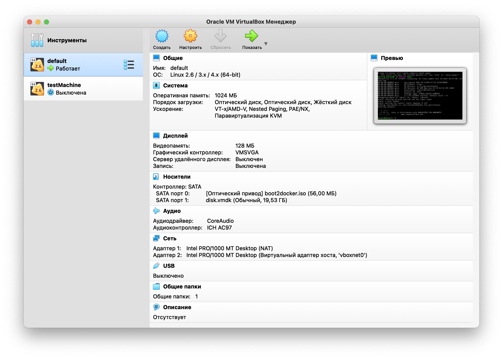
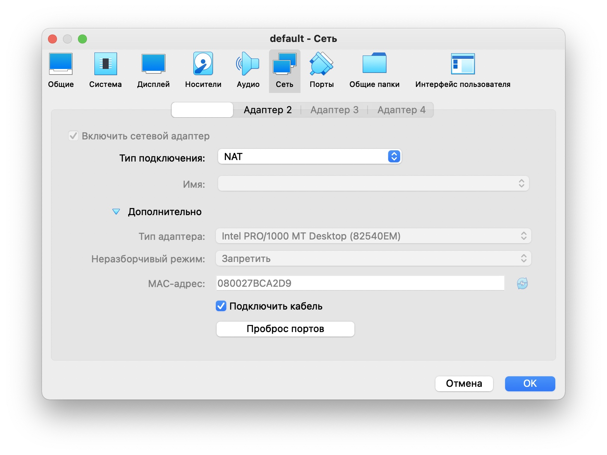
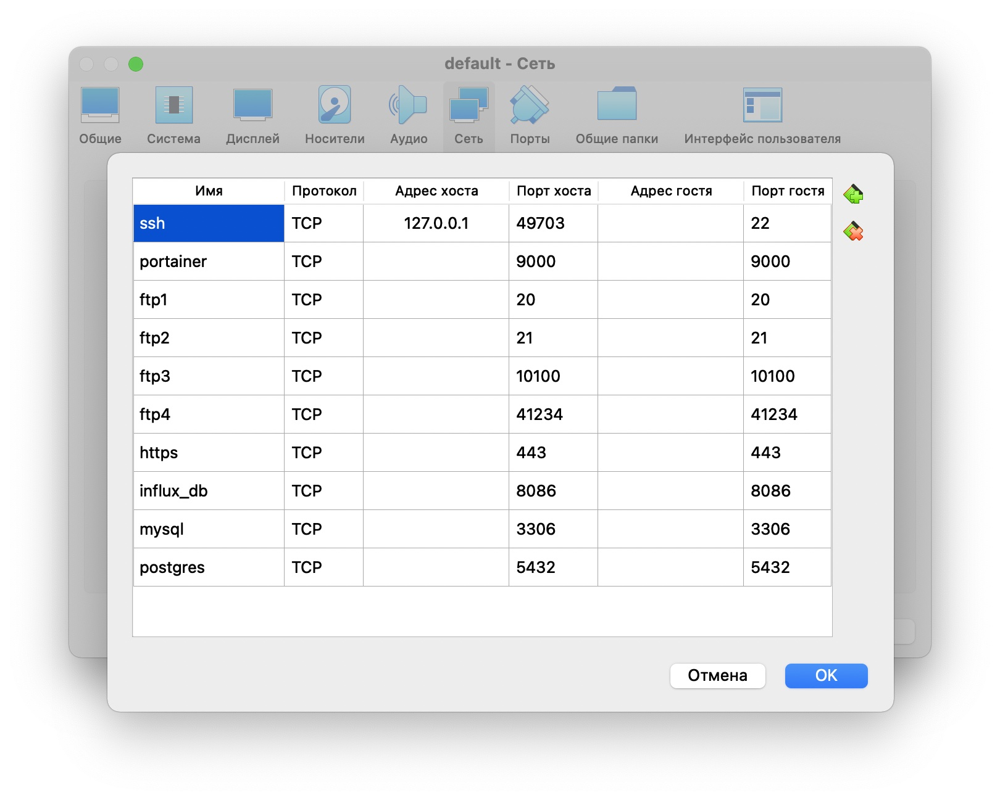
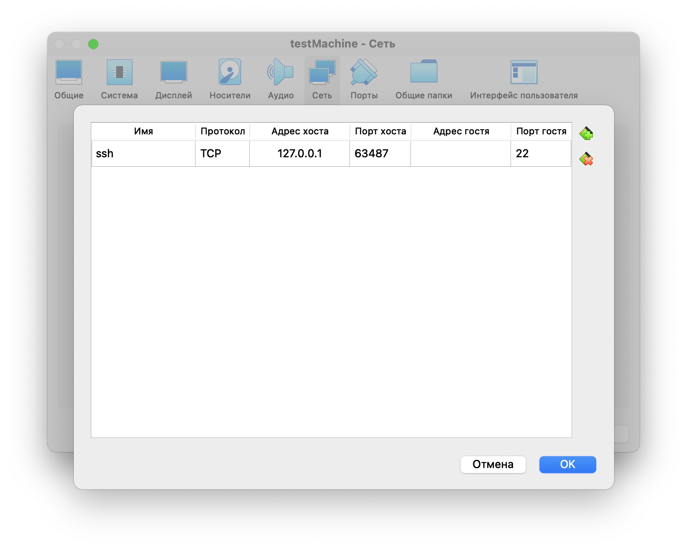

# Проект Inception 42.fr

Этот проект направлен на расширение знаний в области системного администрирования с помощью Docker. Мы создадим несколько образов Docker, создав их вируальной машине.

Требования проекта:

* Этот проект необходимо выполнить на виртуальной машине.
* Все файлы, необходимые для настройки вашего проекта, должны быть помещены в папку srcs.
* Также необходим Makefile, который должен находиться в корне вашего каталога. Он должен настроить все ваше приложение (т.е. он должен создавать образы Docker с помощью docker-compose.yml).
* Этот предмет требует применения на практике концепций, которые, в зависимости от вашего опыта, вы, возможно, еще не усвоили. Поэтому мы советуем вам не стесняться читать много документации, связанной с использованием Docker, а также всего остального, что вы сочтете полезным, чтобы выполнить это задание.

Разрабатывая проект мы идем по следующим шагам:

0. Устанавливаем home brew
1. Устанавливаем вируальную машину, используя VirtualBox (этот шаг можно заменить покупкой Linux машины на AWS/GoogleCloud или любом другом хостинге)
2. Устанавливаем менеджер докер машины (которая будет управлять докер демоном в Линуксе на вируальной машине или в облаке)
3. Устанавливаем линукс внутри виртуальном машины / настриваем проброс портов с рабочего линукса во вне вируальной машины
4. Настраиваем окружение/линки для работы с данным демоном докера (работающим на линуксе внутри VirtualBox`а)
5. Устанавливаем докер и докер-компоус для работы с локальной машины MaxOSX
6. Настраиваем оркестратор докер-компоус (ну и Makefile для его быстрого поднятия/остановки)
7. Создаем требуемые образы докера, которые будут запускаться оркестратором и которые будут между собой взаимодействовать и отдавать результат во внешний мир
8. Запоминаем команды для работы со всем хозяйством


### TL;DR

For short, the entire installation process is as follows.

```https://medium.com/crowdbotics/a-complete-one-by-one-guide-to-install-docker-on-your-mac-os-using-homebrew-e818eb4cfc3```

```https://stackoverflow.com/questions/44084846/cannot-connect-to-the-docker-daemon-on-macos/49719638#49719638```


## 0. Установим homebrew через который будем ставить требуемый софт на MacOS X

Install home brew (https://brew.sh/index_ru)

```
$ /bin/bash -c "$(curl -fsSL https://raw.githubusercontent.com/Homebrew/install/HEAD/install.sh)"
```


## 1. Установка VirtualBox`а на MacOX X (VirtualBox installation via Homebrew)

```
$ brew install virtualbox --cask
```

В целом, мы можем купить любую вируальную машину и накатывать на най то же самое.


## 2. Устанавливаем менеджер докер машины (которая будет управлять докер демоном в Линуксе на вируальной машине или в облаке)

```
$ brew install docker-machine
```

Docker Machine — это утилита, которая нужна вам для того, чтобы устанавливать Docker Engine на удаленные физические или виртуальные сервера, а также управлять ими при помощи команды docker-machine. Вы можете использовать Docker Machine для создания Docker хостов на вашем Mac или Windows ПК, в корпоративной сети вашей компании, в вашем датацентре или в различных Облаках, например, в облаке КРОК, AWS или Digital Ocean.

Используя команды `docker-machine`, вы можете запустить, проверить, остановить, перезапустить управляемый ей хост, обновить клиент и демон Docker, а также настроить клиент Docker на работу с удаленным хостом.

* _Какова разница между Docker Engine и Docker Machine?_

Когда говорят «Docker», обычно имеют в виду Docker Engine, т.е. клиент-серверное программное обеспечение, состоящее из демона Docker, REST API, который определяет интерфейсы взаимодействия с демоном и клиентский консольный командный интерфейс, т.е. клиента docker, который общается с демоном при помощи обертки над REST API.

`Docker Engine` принимает команды `docker`, такие как `docker run <image>` для запуска контейнера из образа, `docker ps` для отображения запущенных контейнеров, `docker images` для отображения доступных образов и т.д.

`Docker Machine` — это утилита для подготовки и управления вашими докеризированными хостами (имеются в виду хосты с установленным на них Docker Engine). Обычно Docker Machine устанавливается на вашу локальную систему. У Docker Machine есть свой консольный клиент docker-machine так же, как клиент для Docker Engine — docker. Вы можете использовать Docker Machine для установки Docker Engine на один или более виртуальных серверов. Эти виртуальные серверы могут быть локальными или удаленными. Докеризированные хосты при этом называются управляемыми машинами («machines»).


## 3. Устанавливаем линукс внутри виртуальном машины / настриваем проброс портов с рабочего линукса во вне вируальной машины

Вы можете создать машину с помощью `docker-machine create (name)` с флагом `--driver`, чтобы указать провайдер, на котором создается машина.

```
$ docker-machine create --driver virtualbox default
[...]
Docker is up and running!
To see how to connect your Docker Client to the Docker Engine running on this virtual machine, run: docker-machine env default
```

Запустите `docker-machine ls`, и вы увидите, что ваша машина по умолчанию создана.

```
$ docker-machine ls
NAME      ACTIVE   DRIVER       STATE     URL                         SWARM   DOCKER      ERRORS
default   *        virtualbox   Running   tcp://192.168.99.120:2376           v19.03.12   
```

Мой текущий вывод выглядит так:

```
$ docker-machine ls
NAME          ACTIVE   DRIVER       STATE     URL                         SWARM   DOCKER      ERRORS
default       *        virtualbox   Running   tcp://192.168.99.120:2376           v19.03.12   
testMachine   -        virtualbox   Stopped                                       Unknown 
```



Важно:
* мы создали машину по умолчанию и если не будем указывать имя докер машины - то все обращения докера будут идти к ней, но нам ничего не мешает создать несколько докер машин
* порт 22 ssh используется для управления данной машиной и он пробрасывается на установленный (подбирается автоматически) порт вне виртуальной машины (у нас не машине по умолчанию это - 49703) - этот порт нельзя закрывать (или менять не меняя файлы конфигурации вашего клиента docker machine) - в противном случае вы потеряете управлением своей машиной
* чтобы можно было достучатся до контейнеров внутри - вам нужно настраивать проброску портов из системы, которая работает внутри VirtualBoxа, в вашу систему MacOS X (пример проброски можно увидеть ниже)








### >>> Подключиться по ssh

Info:
https://stackoverflow.com/questions/30330442/how-to-ssh-into-docker-machine-virtualbox-instance

`docker-machine ssh default`

```
wnormcor@wnormcor ~ % docker-machine ssh default
   ( '>')
  /) TC (\   Core is distributed with ABSOLUTELY NO WARRANTY.
 (/-_--_-\)           www.tinycorelinux.net

docker@default:~$ whoami
docker
```


### >>> Open port in virtual box from local host

```https://stackoverflow.com/questions/36286305/how-do-i-forward-a-docker-machine-port-to-my-host-port-on-osx/36286446```

В настоящее время Docker Machine - это виртуальная машина, работающая под VirtualBox на компьютере, поэтому, чтобы открыть порт приложения необходимо сопоставить порт виртуальной машины с портом хоста. Для этого есть два варианта, но прежде убедитесь, что Docker Machine остановлен:

```
docker-machine stop default     # see PS below if docker machine isn't default
```

Вариант 1. Используйте интерфейс VirtualBox

* Откройте VirtualBox Manager
* Выберите образ VirtualBox для вашей Docker Machine (например, по умолчанию)
* Откройте Настройки -> Сеть -> Дополнительно -> Переадресация портов.
* Добавьте имя своего приложения, желаемый порт хоста (например: 80) и гостевой порт (например: 3000).

Вариант 2 - используйте командную строку VirtualBox

Просто запустите следующую команду со своими параметрами:

```
VBoxManage modifyvm "dev" --natpf1 "myapp,tcp,,80,,3000"
```

Заключительные соображения

Теперь вы можете запустить Docker Machine:

```
docker-machine start default
eval $(docker-machine env default)
```

Затем просто запустите Docker-контейнер приложения и протестируйте его, запустив ```http://localhost/```.


### >>> How to stop docker-machine

Когда вы закончите экспериментировать с Docker, не забудьте остановить машину с помощью этой команды. (Вы можете проверить статус ```docker-machine ls```)

```
$ docker-machine stop default
```

installed Docker, Docker Machine, VirtualBox

```docker-machine create``` created a new Docker virtual machine (named ‘default’)

```docker-machine env``` переключил вашу среду на новую виртуальную машину (названную `default`)

```eval``` использовать докер-клиент (ваш локальный компьютер / терминал) для создания, загрузки и управления контейнерами

```docker run``` Клиент Docker (ваш терминал) создал демон Docker вытащил первое изображение `hello-world` Демон Docker создал контейнер и передал этот вывод клиенту Docker.

```docker-machine stop``` выключить виртуальную машину


### >>> Docker Machine CLI commands

```
active
config
create
env
help
inspect
ip
kill
ls
mount
provision
regenerate-certs
restart
rm
scp
ssh
start
status
stop
upgrade
url
```


## 4. Настраиваем окружение/линки для работы с данным демоном докера (работающим на линуксе внутри VirtualBox`а)

Эта команда настроит все необходимые линки (ее же можно прописать в скрипт инициализации вашего баша, чтобы каждый раз не настраивать окружение)

```eval $(docker-machine env default)```

Как указано в выходных данных команды docker-machine create, выполните следующую команду, чтобы указать Docker, `на каком компьютере` выполнять команду docker.

```
$ docker-machine env default
export DOCKER_TLS_VERIFY="1"
export DOCKER_HOST="tcp://192.168.99.120:2376"
export DOCKER_CERT_PATH="/Users/wnormcor/.docker/machine/machines/default"
export DOCKER_MACHINE_NAME="default"
# Run this command to configure your shell: 
# eval $(docker-machine env default)
```

And connect your shell to the new machine.

```
$ eval $(docker-machine env default)
```


## 5. Устанавливаем докер и докер-компоус для работы с локальной машины MaxOSX

### Install docker

```
$ brew install docker
$ docker --version
Docker version 20.10.8, build 3967b7d28e
```

### Install docker-compose

```
$ brew install docker-compose
$ docker --version
Docker version 20.10.8, build 3967b7d28e
```

### >>> Сейчас можем проверить, что все работает:

```
$ docker run hello-world

Hello from Docker!
This message shows that your installation appears to be working correctly.

To generate this message, Docker took the following steps:
 1. The Docker client contacted the Docker daemon.
 2. The Docker daemon pulled the "hello-world" image from the Docker Hub.
    (amd64)
 3. The Docker daemon created a new container from that image which runs the
    executable that produces the output you are currently reading.
 4. The Docker daemon streamed that output to the Docker client, which sent it
    to your terminal.

To try something more ambitious, you can run an Ubuntu container with:
 $ docker run -it ubuntu bash

Share images, automate workflows, and more with a free Docker ID:
 https://hub.docker.com/

For more examples and ideas, visit:
 https://docs.docker.com/get-started/
```


## 6. Настраиваем оркестратор докер-компоус (ну и Makefile для его быстрого поднятия/остановки)

Для создания файла конфигурации для оркестратора докер-компоуса используем файл docker-compose.yml. Его можно описывать в различных форматах, но важно помнить что параметры могут быть переданы в виде массива значений (кортежей) либо в виде словаря и имеют разных уровень вложенности. При этом часть параметров могут задваться как в виде словарей, так и ввиде массиовов.

Сама спецификация доступна по адресу: https://raw.githubusercontent.com/compose-spec/compose-spec/master/schema/compose-spec.json

Все изменяемые настройки, требуемые проектом, я храню в .env - но дальше я их записываю как константы в шелл скрипты для точкек входа. Делаю это по одной причине: чтобы при инициализированных БД (созданных файлах бд) при изменении их креденшиалс в env - внутренняя связанность проекта при запуске контенеров не пропадала. Чтобы применить новые значения - вам придется сделать очистку volume (с созданными на них файлами БД) и запустить проект заново (он очень быстро пересоберется, так как будут использоваться захешированые слои). Понимаю, что правильней было бы изменить скрипты инциализации, которые бы меняли бы пароли в базах, но для учебного проекта мне показалось это излишним.

При создании образов контейнеров я использую `wnc_имя_сервиса`, а для именования самих контейнеров - использую `cnt_имя_сервис`.

Контейнеры внутри одной сети могут находить себя по имени используя некоторое подобие сети (мы ее создаем), при этом присвоение идет следующим образом: по названию папки, из которой они собраны (поэтому контейнер с `mariadb` будет доступен просто по имени `mariadb` хотя мы это имя нигде ни использовани при сборке), по названию конейнера `cnt_mariadb` и по id контейнера (каждый раз генерируется для вновь запускаемого конейнера)

Немного про политику перезапуска и как ее проверить: https://serverfault.com/questions/884759/how-does-restart-always-policy-work-in-docker-compose


## 7. Создаем требуемые образы докера, которые будут запускаться оркестратором и которые будут между собой взаимодействовать и отдавать результат во внешний мир

Файл для создания каждого образа (из которых создаются бегущуе контейнеры) задаются из файла Dockerfile, которые я положил в папочки каждого проекта. Файл из себя представляет инстркции для докер-инжина, который забирая их себе - создает соответсвующие образы (images) на своей докер машине. А уже эти образы могут быть использованы для запуска/остановки самих контейнеров. При выполнении каждой инструкции создается свой слой - поэтому при создании одного образа - создается множество слоев, которые мы можем захешировать и переиспользовать.

Да, чтобы не плодить файлы конфигации (а они достаточно просты) я записываю прямо из файла Dockerfile и потому уже вызываю из запущеного конейнера, ничего не копируя. Для боевых проектов это плохое решение, но для учебного - почему бы и нет. Я делаю исключение только для файла настройки nginxа но только по причине быстрого включения бонуса adminer и нежелания экранировать большое кол-во спецсимволов.

Тут важно разобраться, что такое точка входа в конетейнер (которая выполняется почти всегда) и запускаемая команда. Я при построении конейнера в точке входа делают требуемые настройки, которые не могу сделать в момент создания контейнера (например настройку БД или размещения файлов), по причине того что эти действия нужно делать на внешних примонтируемых разделах (volumes), а потом делаю exec с вызывающей командой, что фактически подменяет init/pid 1 на требуемый сервис и дальше уже ожидаю, что запущенный сервис будет корректно отрабатывать сиганалы (выступая диспетчером для дочерних своих процессов) и занимаясь очисткой.

Самое важное, что стоит понять - что при запуске каждого образа - мы фактически запускаем каждый раз виртуализированный линукс, который работает в соответствии с юникс спецификацией. То есть создается init процесс с PID 1, который должен подчищать системные ресурсы, собирать зомби процессы и вообще, образно говоря, брать очень многие функции init-процесса на себя (о чем конечно при разработке обычных приложений мы не думаем) - он защищен от сигналов других процессов и при его завершении ОС тоже завершает работу. При остановке/выключении докер контейнера докер-энджин посылает сигнал PID 1 на завершение (SIGTERM), который обычный shell/sh/bash (как мы помним по проекту shell) просто игнорирует и не обрабатывает. Поэтому мы при запуске и делаем exec. Большинство сервисов (mariadb/nginx/php) прекрасно работают в качестве pid 1, порождая/подчищая только им требуемые процессы. 

Чуть подбробнее:
* Docker: правильный запуск процессов в контейнере с PID 1: https://it-lux.ru/docker-entrypoint-pid-1
* Docker and the PID 1 zombie reaping problem: https://blog.phusion.nl/2015/01/20/docker-and-the-pid-1-zombie-reaping-problem/
* Как использовать систему Tini Init в контейнерах Docker https://computingforgeeks.com/use-tini-init-system-in-docker-containers/
* jenkins-docker: https://github.com/sudo-bmitch/jenkins-docker
* Docker и все, все, все: https://habr.com/ru/company/southbridge/blog/512246/

Но ряд сервисов (например vsftpd из бонусов) не может корректно работать как pid 1, валясь с сегой (можете поэксперементировать, но может проблема к тому моменту уже будет исправлена), поэтому я оставляю bash и делаю ловушки (trap), для обработки сигналов от dockerа (закладывая логику остановки всех процессов и выхода из pid 1). Для этих целей можно использовать tini (отличная программа для init/pid 1), которая может заниматся процессами очистки (быть жнецом для зомби процессов), диспетчерирования сигналов и быть даже поджнецом (если ее запускать не как pid 1 с соответсвующей настройкой), но я попытался сделать это все на bash (хотя точно есть другие нормальные реализации - нужно гуглить).

К сожалению большинство регализация учебных проектов, которые я видел этого не делают и как следствие контейнеры не могут быть остановлены штатно (докер посылает сигнал завершения, ждет 10 секунд в течение которых ничего не происходит и просто прибивает все процессы в конейнере `kill -9`, что может привести к плачевным последствия, если речь идет например о базе данных, которая что-то в этот момент пишет).

Да, для ряда сервисов при запуске (не важно pid1 не pid1) требуется изменить id пользователя от котого запускает этот сервис. Например postgres требует понижения привилегий до обычного пользоваля postgres и у нас два варианта - сделать `exec sudo -u postgres postgres ...`, но тогда запуститься процесс sudo, который сделает fork и дочерний процесс сделает exec на postgres, но сам sudo вряд ли будет хорошим init процессом, поэтому второй вариант использовать утилиту `gosu` которая решает вопрос диспетчерирования сигналов и прочее самостоятельно (и в руководстве по докер вы увидете примере ее использования - которые я фактически с небольшими доработками использую сам). Да и tini и gosu нужно ставить отдельными пакетами в дебиан.

Подробнее о gosu:
* Why should you use Gosu in docker?: https://developpaper.com/why-should-you-use-gosu-in-docker/
* Docker using gosu vs USER: https://stackoverflow.com/questions/36781372/docker-using-gosu-vs-users
* GitHub GOSU: https://github.com/tianon/gosu


## 8. Запоминаем команды для работы со всем хозяйством

### как ходить на докер машину
`docker-machine ssh default`

### собрать образ в докере с именем и тагом
`docker build . -t wnc_mariadb_alp:v0.9.2`

`docker images`

### запустить образ с требуемой командой (или командой по умолчанию)
`docker run 61da230940c0 echo "some"`


### запустить докер интерактивно
`docker run 17e54b9ff6f5 ash -it`
`/usr/bin/mysqld_safe --datadir='/var/lib/mysql/data'`

### show all open ports
`lsof -i TCP| fgrep LISTEN`


### посмотреть полные строчки в выводе
`docker container ls --no-trunc`

### Снести все контейнеры

`docker stop $(docker ps -a -q)`

или

`docker kill $(docker ps -q)`
`docker rm $(docker ps -a -q)`
`docker rmi $(docker images -q)`

если не помогает - forced (при нескольких лейблах)

`docker rmi -f $(docker images -q)`

### референс по докер файлы + что делаем с постгресс
https://docs.docker.com/engine/reference/builder/

### важно про pid1
https://it-lux.ru/docker-entrypoint-pid-1/

### настроить окружение
`eval $(docker-machine env default)`

### сходить на докер-машину
`docker-machine ssh default`

### посмотреть логи
`docker logs d0c85594aae2`

### запустить исполнение програмы в готовом контейнере:
`docker exec -it имя/id_контейнера bash`

### volumes
`docker volume rm $(docker volume ls -q)`

### контейнеры (удалить все)
`docker rm $(docker ps -qa)`

### сети/снести все
`docker network rm $(docker network ls -q)`

### закинуть файлы
`docker cp my.cnf d7b5c7f2c0cb:/etc/mysql/my.cnf`
`sudo docker cp my.cnf d7b5c7f2c0cb:/etc/mysql/my.cnf`

### входим в контейнер для отладки
`docker exec -it mariadb /bin/sh`

### запустить баш в контейнере
`clear && docker exec -it cnt_mariadb /bin/bash`

### убить в контейнере
`docker exec cnt_mariadb kill -9 16010`

### ps 
`ps auxf`
`pstree -al`

### найти все сокеты
`find / -type s`
https://stackoverflow.com/questions/11990708/error-cant-connect-to-local-mysql-server-through-socket-var-run-mysqld-mysq

### посмотреть процессы
`docker exec -it cnt_mariadb ps wauxf`

`ls -n, --numeric-uid-gid`

### запустить свой веб If Python version returned above is 3.X
`python3 -m http.server`

### какие порты отрыты:
`RUN apt-get install -y net-tools`
`netstat -npl`

### сигналы:
`"SIGTERM -> 15" Завершение Сигнал завершения (сигнал по умолчанию для утилиты kill)`

### очистка докер машины

https://medium.com/southbridge/tidy-and-sparkling-docker-environment-with-new-docker-cleanup-commands-ru-6c3166fb69e5

Очистить систему можно с помощью команды docker system prune.
По умолчанию будут удалены остановленные контейнеры, висячие образы
(слои, не связанные с используемыми образами), тома и сети,
не относящиеся к работающим контейнерам. Опция -a позволяет удалить
не только висячие, но и вообще все неиспользуемые образы
(не ассоциированные с запущенными контейнерами).
Опция -f подавляет запросы на подтверждения.
Обе опции по умолчанию выключены.

Удаляем все ненужные контейнеры с помощью docker container prune
Удаляем все ненужные образы с помощью `docker image prune`
чуть про очистку https://habr.com/ru/post/486200/
`docker rm $(docker ps -aq)`

```
fclean: clean
	docker container prune -f
	docker network prune -f
	docker volume rm $(docker volume ls -q)
	# docker image prune
```

## Немного о состоянии процессов

https://laurvas.ru/bash-trap/
https://www.opennet.ru/docs/RUS/bogatyrev/gl_6_4.html

PROCESS STATE CODES
       Here are the different values that the s, stat and state output specifiers (header "STAT" or "S") will display to describe the state of a process:
       D    uninterruptible sleep (usually IO)
       R    running or runnable (on run queue)
       S    interruptible sleep (waiting for an event to complete)
       T    stopped, either by a job control signal or because it is being traced.
       W    paging (not valid since the 2.6.xx kernel)
       X    dead (should never be seen)
       Z    defunct ("zombie") process, terminated but not reaped by its parent.

       For BSD formats and when the stat keyword is used, additional characters may be displayed:
       <    high-priority (not nice to other users)
       N    low-priority (nice to other users)
       L    has pages locked into memory (for real-time and custom IO)
       s    is a session leader
       l    is multi-threaded (using CLONE_THREAD, like NPTL pthreads do)
       +    is in the foreground process group.

=========================================================================

#!/bin/bash
trap '' SIGINT SIGTERM SIGHUP SIGQUIT
sleep 1m

	основные сигналы:
		SIGINT	2	Завершение	Сигнал прерывания (Ctrl-C) с терминала


### про очистку:

https://habr.com/ru/post/486200/