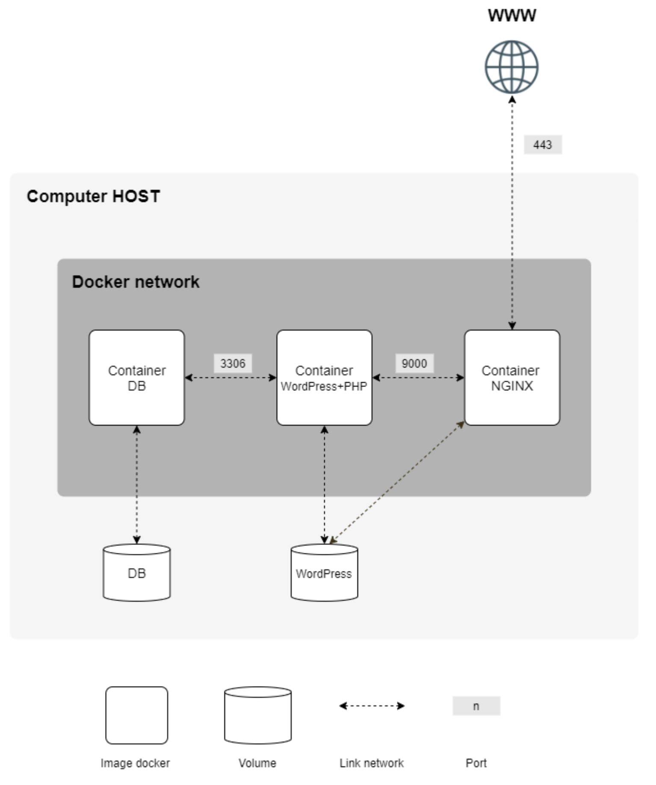

# Subject

Этот проект направлен на расширение знаний в области системного администрирования с помощью Docker. Вы виртуализируете несколько образов Docker, создав их на своей новой персональной виртуальной машине.

## General guidelines

* Этот проект необходимо выполнить на виртуальной машине.
* Все файлы, необходимые для настройки вашего проекта, должны быть помещены в папку srcs.
* Также необходим Makefile, который должен находиться в корне вашего каталога. Он должен настроить все ваше приложение (т.е. он должен создавать образы Docker с помощью docker-compose.yml).
* Этот предмет требует применения на практике концепций, которые, в зависимости от вашего опыта, вы, возможно, еще не усвоили. Поэтому мы советуем вам не стесняться читать много документации, связанной с использованием Docker, а также всего остального, что вы сочтете полезным, чтобы выполнить это задание.

## Mandatory part

Этот проект заключается в том, что вы настраиваете небольшую инфраструктуру, состоящую из различных служб по определенным правилам. Весь проект должен быть выполнен на виртуальной машине. Вы должны использовать docker-compose.

У каждого образа Docker должно быть то же имя, что и у соответствующей службы.

Каждая служба должна работать в выделенном контейнере.

По соображениям производительности контейнеры должны быть созданы либо из предпоследней стабильной версии Alpine Linux, либо из Debian Buster. Выбор остается за вами.

Вы также должны написать свои собственные файлы Dockerfile, по одному для каждой службы. Файлы Dockerfiles должны вызываться в файле docker-compose.yml из файла Makefile.

Это означает, что вы должны сами создавать образы Docker для своего проекта. Затем запрещается извлекать готовые образы Docker, а также использовать такие службы, как DockerHub (Alpine / Debian исключены из этого правила).

Затем вам необходимо настроить:
* Контейнер Docker, содержащий только NGINX с TLSv1.2 или TLSv1.3.
* Контейнер Docker, содержащий WordPress + php-fpm (он должен быть установлен и настроен) только без nginx.
* Контейнер Docker, содержащий MariaDB только без nginx.
* Том, содержащий вашу базу данных WordPress.
* Второй том, содержащий файлы вашего сайта WordPress.
* Докер-сеть, которая устанавливает соединение между вашими контейнерами. В случае сбоя ваши контейнеры должны перезапускаться.

> Контейнер Docker - это не виртуальная машина. Таким образом, это не
рекомендуется использовать любой хакерский патч на основе 'tail -f' и т. д.
при попытке запустить его. Читайте о том, как работают демоны и есть ли это
хорошая идея использовать их или нет.

> Конечно, использование network: host или --link или links: запрещено.
Сетевая строка должна присутствовать в вашем файле docker-compose.yml.
Ваши контейнеры не должны запускаться командой, выполняющей бесконечное
петля. Таким образом, это также относится к любой команде, используемой в качестве точки входа, или
используется в сценариях точек входа. Ниже приведены несколько запрещенных хакерских атак.
патчи: tail -f, bash, бесконечность сна, пока правда.

> Прочтите о PID 1 и лучших методах написания файлов Docker.

* В вашей базе данных WordPress должно быть два пользователя, один из которых является администратором. Имя пользователя администратора не может содержать admin/Admin или admin/Administrator (например, admin, administrator, Administrator, admin-123 и т.д.).

> Ваши тома будут доступны в папке /home/login/data на хост-машине с использованием Docker. Разумеется, нужно сменить логин с твоим.

Чтобы упростить задачу, вы должны настроить свое доменное имя так, чтобы оно указывало на ваш локальный IP-адрес.

Это доменное имя должно быть login.42.fr. Опять же, вы должны использовать свой собственный логин. Например, если ваш логин - wil, wil.42.fr будет перенаправлять на IP-адрес, указывающий на веб-сайт wil.

> "latest tag" запрещен.

> В ваших файлах Dockerfiles не должно быть пароля.

> Обязательно использовать переменные среды.
Также настоятельно рекомендуется использовать файл .env для хранения переменные среды. Файл .env должен находиться в корне srcs 

> Ваш контейнер NGINX должен быть единственной точкой входа в ваш инфраструктура только через порт 443, используя TLSv1.2 или TLSv1.3 протокол.

Here is an example diagram of the expected result:



Below is an example of the expected directory structure:

```
$> ls -alR
total XX
drwxrwxr-x 3 wil wil 4096 avril 42 20:42 .
drwxrwxrwt 17 wil wil 4096 avril 42 20:42 ..
-rw-rw-r-- 1 wil wil XXXX avril 42 20:42 Makefile
drwxrwxr-x 3 wil wil 4096 avril 42 20:42 srcs
./srcs:
total XX
drwxrwxr-x 3 wil wil 4096 avril 42 20:42 .
drwxrwxr-x 3 wil wil 4096 avril 42 20:42 ..
-rw-rw-r-- 1 wil wil XXXX avril 42 20:42 docker-compose.yml
-rw-rw-r-- 1 wil wil XXXX avril 42 20:42 .env
drwxrwxr-x 5 wil wil 4096 avril 42 20:42 requirements
./srcs/requirements:
total XX
drwxrwxr-x 5 wil wil 4096 avril 42 20:42 .
drwxrwxr-x 3 wil wil 4096 avril 42 20:42 ..
drwxrwxr-x 4 wil wil 4096 avril 42 20:42 bonus
drwxrwxr-x 4 wil wil 4096 avril 42 20:42 mariadb
drwxrwxr-x 4 wil wil 4096 avril 42 20:42 nginx
drwxrwxr-x 4 wil wil 4096 avril 42 20:42 tools
drwxrwxr-x 4 wil wil 4096 avril 42 20:42 wordpress
./srcs/requirements/mariadb:
total XX
drwxrwxr-x 4 wil wil 4096 avril 42 20:45 .
drwxrwxr-x 5 wil wil 4096 avril 42 20:42 ..
drwxrwxr-x 2 wil wil 4096 avril 42 20:42 conf
-rw-rw-r-- 1 wil wil XXXX avril 42 20:42 Dockerfile
-rw-rw-r-- 1 wil wil XXXX avril 42 20:42 .dockerignore
drwxrwxr-x 2 wil wil 4096 avril 42 20:42 tools
[...]
./srcs/requirements/nginx:
total XX
drwxrwxr-x 4 wil wil 4096 avril 42 20:42 .
drwxrwxr-x 5 wil wil 4096 avril 42 20:42 ..
drwxrwxr-x 2 wil wil 4096 avril 42 20:42 conf
-rw-rw-r-- 1 wil wil XXXX avril 42 20:42 Dockerfile
-rw-rw-r-- 1 wil wil XXXX avril 42 20:42 .dockerignore
drwxrwxr-x 2 wil wil 4096 avril 42 20:42 tools
[...]
$> cat srcs/.env
DOMAIN_NAME=wil.42.fr
# certificates
CERTS_=./XXXXXXXXXXXX
# MYSQL SETUP
MYSQL_ROOT_PASSWORD=XXXXXXXXXXXX
MYSQL_USER=XXXXXXXXXXXX
MYSQL_PASSWORD=XXXXXXXXXXXX
[...]
$>
```

## Bonus part

For this project, the bonus part is aimed to be simple.

A Dockerfile must be written for each extra service. Thus, each one of them will run inside its own container and will have, if necessary, its dedicated volume.

Bonus list:
* Set up redis cache for your WordPress website in order to properly manage the cache.
* Set up a FTP server container pointing to the volume of your WordPress website.
* Create a simple static website in the language of your choice except PHP (Yes, PHP
is excluded!). For example, a showcase site or a site for presenting your resume.
* Set up Adminer.
* Set up a service of your choice that you think is useful. During the defense, you will have to justify your choice.

> To complete the bonus part, you have the possibility to set up extra
services.  In this case, you may open more ports to suit your needs.

> The bonus part will only be assessed if the mandatory part is
PERFECT. Perfect means the mandatory part has been integrally done
and works without malfunctioning.  If you have not passed ALL the
mandatory requirements, your bonus part will not be evaluated at all.
